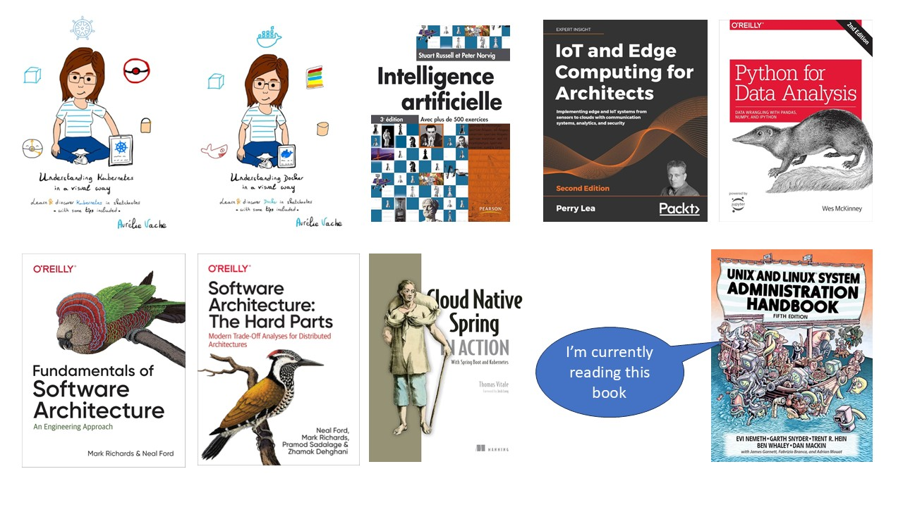

### Hello, nice to meet you 👋

[page updated on 05/03/2025]

🖥️ currently working at VMware by Broadcom

✔️ [Challenge 90 Days of DevOps](https://github.com/MichaelCade/90DaysOfDevOps) finished in January 2023

✔️ Google Code JAM 2022

https://leetcode.com/u/user4578HQ/

### 👉 My Technical confort zone & technologies that I used or that I'm learning :

- Cloud: Docker Kubernetes VMware Azure AWS
- Code: Python Java,Go, C and C++
- Web: HTML CSS Javascript
- Database: PostGreSQL
- CLI: PowerShell/PowerCLI, Linux
- Automation:  Terraform Ansible

### 📚 Books I've read:

Data and IA:

- Intelligence artificielle - Stuart Russel et Peter Norvig - Pearson edition

- Python for Data Analysis - Wes McKinney - O'reilly edition

Architecture:

- Iot and Edge computing for Architects- Perrry Lea - Packt edition

- Fundamentals of Software Architecture - Mark Richards and Neal Ford - O'reilly edition
  
- Software Architecture: The Hard parts - Mark Richards and Neal Ford - O'reilly edition

Containers and Orchestrators:

- Understanding Docker in a visual way - Aurélie Vache
  
- Understanding Kubernetes in a visual way - Aurélie Vache

### But wait 🛑 , I also read businness related books:

https://medium.com/@louis.debouzy7/my-personal-mba-reading-list-475e385e0501
